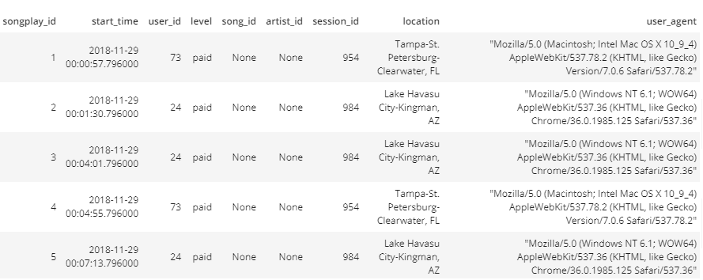
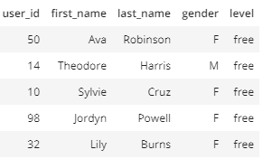
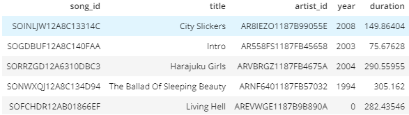
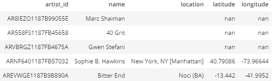
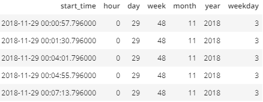

# Data Modeling and ETL with PostgreSQL, and Python

## Introduction & Purpose

Got some song and user log activity data from a Music Streaming app and wanted to understand what songs users are listening to. Currently there is no easy way to query the data, because the data is in JSON logs.

So, time to use data engineer skills to create a Postgres database with tables designed to optimize queries on song play analysis. I have defined fact and dimension tables for a star schema for a particular analytic focus, and developed an ETL pipeline that transfers data from files in two local directories into these tables in Postgres using Python and SQL.

## Databases
### Database: sparkifydb

1. create_tables.py and sql_queries.py are used to creates tables, select, insert rows within a Postgresql database named 'sparkifydb'
    
2. The database has been created using a 'star schema' with fact and dimension tables, to allow analysis of user's 'song plays' on the app
    
3. Two collections of JSON log files are the data sources for the database: 'song data' and 'log_data'

## Tables & Schemas

### Fact Table: songplays
    
1. Comprised of event data from the log_data JSON files, where the 'page' is equal to 'NextSong' - indicating that the user is playing songs via the app - other values for 'page' are excluded from the table
    
2. Table is created by combining the log_data and song_data JSON logs (artist_id and song_id columns are from the songs and artists tables which is created using song_data)

**Table schema**
    
songplay_id SERIAL PRIMARY KEY   
start_time TIME    
user_id INTEGER   
level TEXT  
song_id TEXT  
artist_id TEXT   
session_id INTEGER   
location TEXT   
user_agent TEXT   

### Dimension Table: users

* Created with data from the log_data JSON files

**Table schema**
    
user_id INTEGER PRIMARY KEY    
first_name TEXT    
last_name TEXT    
gender TEXT    
level TEXT     

### Dimension Table: songs 

* Created with data from the song_data JSON files
    
**Table schema**
    
song_id TEXT PRIMARY KEY    
title TEXT    
artist_id TEXT    
year INTEGER     
duration FLOAT     
    

### Dimension Table: Artists

* Created with data from the song_data JSON files
    
**Table schema**
    
    
artist_id TEXT PRIMARY KEY     
name TEXT     
location TEXT    
latitude FLOAT    
longitude FLOAT     
    

### Dimension Table: time

1. Created with data from the log_data JSON files
    
2. The table features the timestamp of each song play broken down into individual units of time in columns
    
**Table schema**
    
time TIMESTAMP    
hour INT     
day INT     
week INT     
month INT     
year INT     
weekday INT     

